# 🎨 ICONES.md — Catálogo de ícones por página/aba

> **O que é este arquivo:** o lugar ÚNICO onde todo ícone do jogo está
> catalogado, organizado pela **aba/página onde ele aparece**. Criado na
> sessão 081 (FASE 7.2 do `PLANO_ACAO.md`), a pedido do Davi, pra parar
> de precisar caçar ícone em `GameIcon.jsx` — ou baixar de novo o que já
> existe.
>
> **Diferença pro `RECURSOS.md`:** aquele organiza por TIPO DE RECURSO
> (baú/power-up/poção), com preço e probabilidade, sem imagem. Este aqui
> organiza por TELA e **mostra a imagem**.
>
> Abre no Obsidian com as imagens aparecendo; no GitHub também.
>
> **Versão visual (grade grande, com busca):**
> https://claude.ai/code/artifact/698e1a4e-0a05-4532-a4dc-6739303d01b5
> — gerada por `scripts/gerar-catalogo-icones.py`. Depois de acrescentar
> um ícone novo, rodar `python scripts/gerar-icones-md.py` (atualiza este
> arquivo) e `python scripts/gerar-catalogo-icones.py` (atualiza a página).

---

## ➕ Como adicionar um ícone novo (fluxo combinado)

1. Você baixa a arte e **eu digo o nome do arquivo** (regra da sessão 078).
2. Eu processo (remoção de fundo, recorte, redimensionamento) e salvo em
   `src/assets/icons/<nome>.png`.
3. Registro em `src/components/GameIcon.jsx` (import + entrada no mapa `ICONS`).
4. Guardo o **original** em `referencias/icones/<categoria>/` — nunca mais
   se perde nem precisa ser baixado de novo.
5. Acrescento a linha aqui, na seção da tela onde ele é usado.

**Uso no código:** `<GameIcon name="ofensiva" size={24} />`

---

## 1. Barra lateral — `Sidebar.jsx`

| Ícone | Nome no código | O que é | Onde aparece |
|:---:|---|---|---|
| 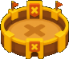 | `arena` | Ícone da Arena (tela principal de jogo) | Menu lateral |
|  | `liga` | Ícone da aba de Ligas | Menu lateral |
|  | `missoes` | Ícone da aba de Missões | Menu lateral · Loja |
|  | `loja` | Ícone da aba da Loja | Menu lateral |
|  | `mochila` | Ícone da Mochila (inventário) | Menu lateral · MochilaPage |

---

## 2. Header — barra de status no topo

| Ícone | Nome no código | O que é | Onde aparece |
|:---:|---|---|---|
|  | `ofensiva` | Chama da ofensiva acesa | Header · Menu · Perfil · Stats · Loja · resumo pós-partida |
|  | `ofensiva-congelada` | Chama azul — ofensiva congelada pelo Seguro. **NÃO é escudo** | Header · Loja (Seguro de Ofensiva) |
|  | `moedas` | Moeda do jogo | Header · Loja · Missões · resumo pós-partida |
|  | `vidas` | Coração de vidas diárias | Header · durante a partida |
|  | `xp` | Ícone de XP | Header · Perfil · resumo pós-partida |
|  | `dia-feito` | Círculo laranja com check — dia jogado | Calendário do Header · resumo pós-partida (pág. 4) |
|  | `dia-congelado` | Dia coberto pelo Seguro de Ofensiva | Calendário do Header |
|  | `dia-vazio` | Círculo cinza — dia não jogado | Calendário do Header · resumo pós-partida (pág. 4) |

---

## 3. Ligas e pódio — `RankingPage.jsx`

| Ícone | Nome no código | O que é | Onde aparece |
|:---:|---|---|---|
|  | `liga-bronze` | Divisão 1 — Bronze | Escada de divisões · card da liga |
| 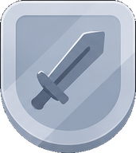 | `liga-prata` | Divisão 2 — Prata | Escada de divisões · card da liga |
| 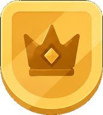 | `liga-ouro` | Divisão 3 — Ouro | Escada de divisões · card da liga |
| 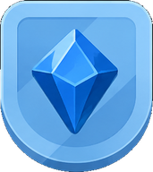 | `liga-safira` | Divisão 4 — Safira | Escada de divisões · card da liga |
| 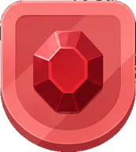 | `liga-rubi` | Divisão 5 — Rubi | Escada de divisões · card da liga |
| 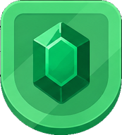 | `liga-esmeralda` | Divisão 6 — Esmeralda | Escada de divisões · card da liga |
| 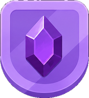 | `liga-ametista` | Divisão 7 — Ametista | Escada de divisões · card da liga |
|  | `liga-perola` | Divisão 8 — Pérola | Escada de divisões · card da liga |
| 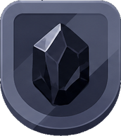 | `liga-obsidiana` | Divisão 9 — Obsidiana | Escada de divisões · card da liga |
| 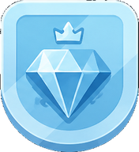 | `liga-diamante` | Divisão 10 — Diamante | Escada de divisões · card da liga |
|  | `divisao-bloqueada` | Cadeado — divisão ainda não alcançada | Escada de divisões |
|  | `posicao-1` | Medalha de 1º lugar | Classificação da liga |
|  | `posicao-2` | Medalha de 2º lugar | Classificação da liga |
|  | `posicao-3` | Medalha de 3º lugar | Classificação da liga |
|  | `podio` | Pódio | Menu · Perfil · Estatísticas · Ranking |

---

## 4. Missões — `MissionsPage.jsx`

| Ícone | Nome no código | O que é | Onde aparece |
|:---:|---|---|---|
|  | `missao-diaria` | Sol — cabeçalho das missões diárias | Aba Missões |
|  | `missao-mensal` | Calendário — cabeçalho dos desafios mensais | Aba Missões |
|  | `missao-tipo-partidas` | Controle de videogame — missão `play` (jogue N partidas) | Aba Missões · resumo pós-partida (pág. 3) |
|  | `missao-tipo-precisao` | Alvo — missões `accuracy`, `streak`, `correct_*` | Aba Missões · resumo pós-partida (pág. 3) |
|  | `missao-tipo-pontuacao` | 100 — missão `score` (pontuação) | Aba Missões · resumo pós-partida (pág. 3) |
|  | `missao-travada` | Cadeado de missão bloqueada | Aba Missões |
|  | `pu-congelar` | Botão "Congelar missão" (mesma arte da Loja) | Aba Missões · Loja |

---

## 5. Loja — `ShopPage.jsx` (power-ups e poções)

| Ícone | Nome no código | O que é | Onde aparece |
|:---:|---|---|---|
|  | `pu-vida-extra` | Vida Extra — coração com cruz (80 moedas) | Loja · durante a partida |
|  | `pu-congelar` | Congelar Missão (50 moedas) | Loja · Missões |
|  | `pu-largada` | Largada Turbo (90 moedas) | Loja |
| 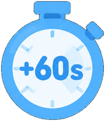 | `pu-tempo` | +60s no relógio (120 moedas) | Loja |
|  | `pu-escudo` | Escudo — protege do próximo erro (100 moedas) | Loja |
|  | `ofensiva-congelada` | Seguro de Ofensiva (100 moedas) | Loja |
|  | `pocao-xp-1` | Poção de XP ×1,5 — tubo de ensaio | Loja · Mochila · recompensas |
|  | `pocao-xp-2` | Poção de XP ×2 — erlenmeyer | Loja · Mochila · recompensas |
|  | `pocao-xp-3` | Poção de XP ×3 — frasco redondo | Loja · Mochila · recompensas |

---

## 6. Baús — Mochila e recompensas

| Ícone | Nome no código | O que é | Onde aparece |
|:---:|---|---|---|
| 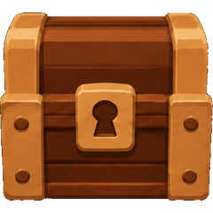 | `bau-madeira` | Baú de Madeira fechado (10-100 moedas) | Mochila · decoração |
|  | `bau-ferro` | Baú de Ferro fechado (200-400 moedas) | Mochila · decoração |
|  | `bau-ouro` | Baú de Ouro fechado (500-800 moedas) | Mochila · decoração |
| 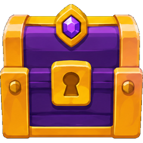 | `bau-mistico` | Baú Místico fechado (1.000 moedas) | Mochila · decoração |
| 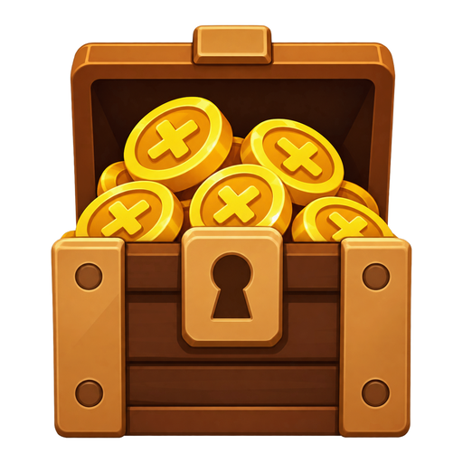 | `bau-madeira-aberto` | Baú de Madeira ABERTO, com moedas à vista | Resumo pós-partida (pág. 6) |
| 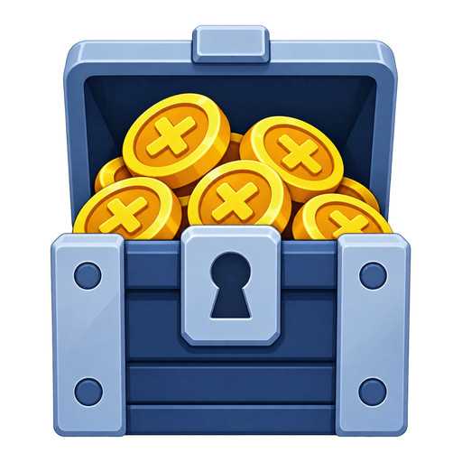 | `bau-ferro-aberto` | Baú de Ferro ABERTO, com moedas à vista | Resumo pós-partida (pág. 6) |
| 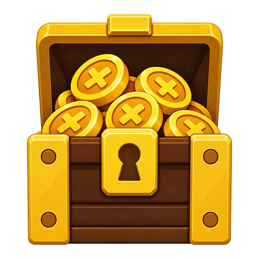 | `bau-ouro-aberto` | Baú de Ouro ABERTO, com moedas à vista | Resumo pós-partida (pág. 6) |
| 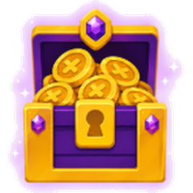 | `bau-mistico-aberto` | Baú Místico ABERTO, com moedas à vista | Resumo pós-partida (pág. 6) |
|  | `bau-moedas` | Baú com moedas | Reserva — sem uso ativo hoje |

---

## 7. Resumo pós-partida — `PostGameSummary.jsx`

**Ícones combo (recurso + baú numa imagem só)** — a página de recompensa
de cada power-up/poção usa estes. O tier do baú é a classificação própria
que você definiu (D054), não a raridade da Loja.

| Ícone | Nome no código | O que é | Onde aparece |
|:---:|---|---|---|
| 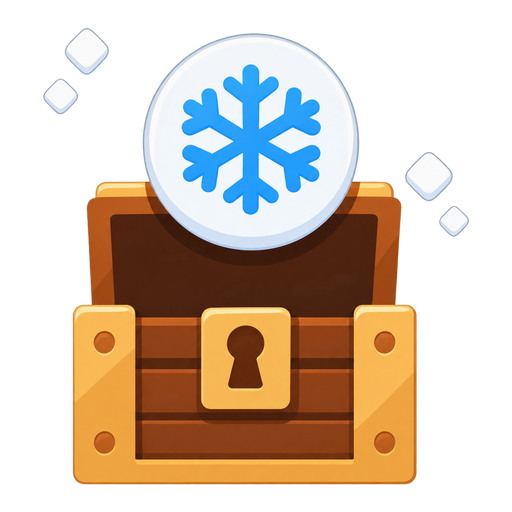 | `combo-congelar` | Congelar Missão + Baú de Madeira | Página 6 (recompensa) |
|  | `combo-vida-extra` | Vida Extra + Baú de Madeira | Página 6 (recompensa) |
|  | `combo-largada` | Largada Turbo + Baú de Ferro | Página 6 (recompensa) |
| 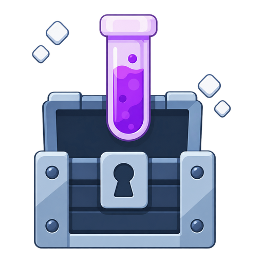 | `combo-pocao-1` | Poção ×1,5 + Baú de Ferro | Página 6 (recompensa) |
| 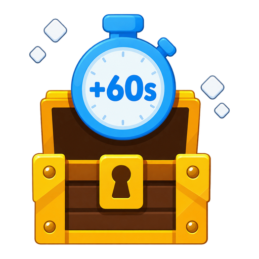 | `combo-tempo` | +60s + Baú de Ouro | Página 6 (recompensa) |
| 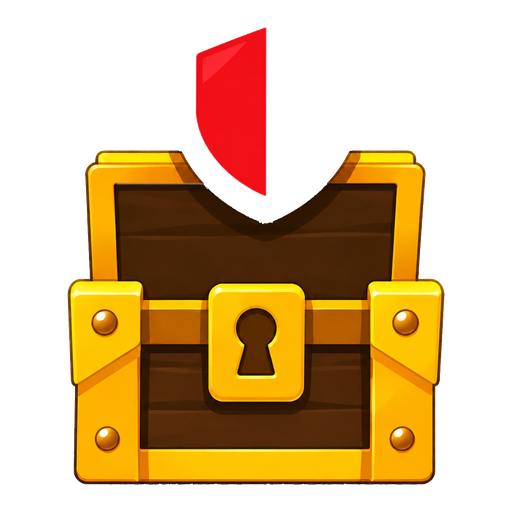 | `combo-escudo` | Escudo + Baú de Ouro | Página 6 (recompensa) |
| 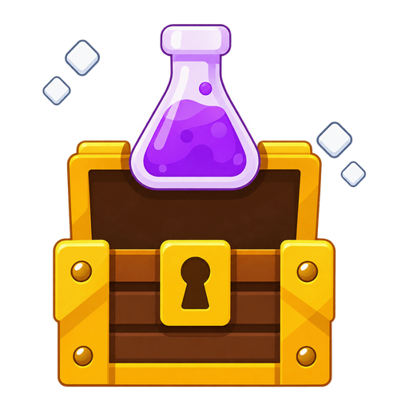 | `combo-pocao-2` | Poção ×2 + Baú de Ouro | Página 6 (recompensa) |
| 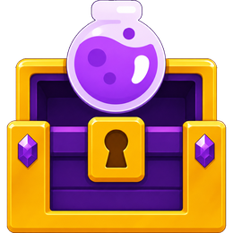 | `combo-pocao-3` | Poção ×3 + Baú Místico | Página 6 (recompensa) |
| 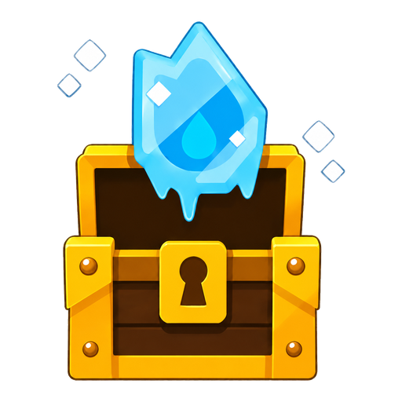 | `combo-seguro-ofensiva` | Seguro de Ofensiva (cristal de gelo) + Baú de Ouro | Página 6 (recompensa) |
|  | `resumo-acertos` | Alvo verde com flecha — acertos | Páginas 1, 2 e 3 |
|  | `resumo-erros` | Bolinha vermelha com X — erros (par do acertos) | Página 1 |
|  | `trofeu` | Troféu (substituiu o `Trophy` da lucide) | Páginas 1 e 5 |
| 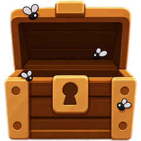 | `bau-vazio` | Baú aberto e vazio, com moscas | Página "Nada desta vez" |

**Os 9 recursos têm combo próprio desde a sessão 082.** O do Seguro de
Ofensiva estava pronto o tempo todo dentro da folha
`combo-grade-completa-v2.png` — eu tinha usado a versão errada (baú de
madeira, que virou o extinto "baú genérico") e deixado a certa, em ouro,
de fora. Ele é o único recortado de dentro de uma folha, então tem
resolução menor que os outros (240 px contra ~260).

**O `bau-recurso` ("baú genérico") foi REMOVIDO na sessão 082** — nunca
foi genérico de verdade, era o exemplo do combo do Seguro no tier errado.

---

## 8. Fundos das páginas de recompensa

Arte de FUNDO por recurso (sessão 083): gradiente na cor do item + o
símbolo dele repetido e desfocado. Ficam em `src/assets/fundos/` (JPEG, sem
transparência, 11-26 KB cada) e são ligados pelo `id` do loot em
`src/components/rewardBackgrounds.js`. Sem entrada no mapa, a página cai no
fundo escuro padrão.

| Fundo | Arquivo | Recurso |
|:---:|---|---|
| 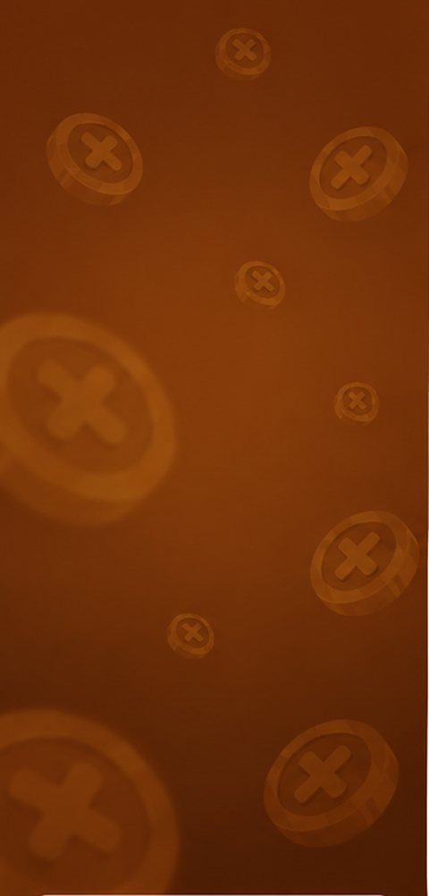 | `fundo-bau-madeira.jpg` | Baú de Madeira |
|  | `fundo-bau-ferro.jpg` | Baú de Ferro |
| 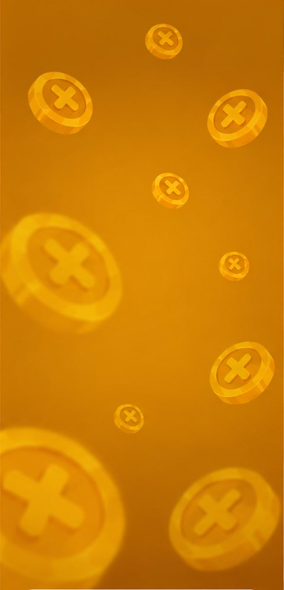 | `fundo-bau-ouro.jpg` | Baú de Ouro |
|  | `fundo-bau-mistico.jpg` | Baú Místico |
| 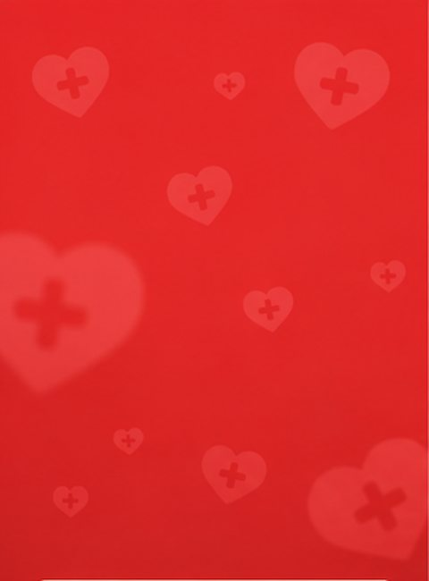 | `fundo-vida-extra.jpg` | Vida Extra |
| 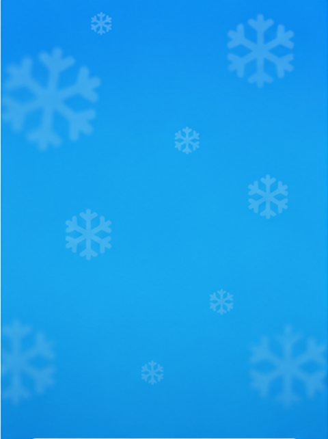 | `fundo-congelar.jpg` | Congelar Missão |
|  | `fundo-largada.jpg` | Largada Turbo |
| 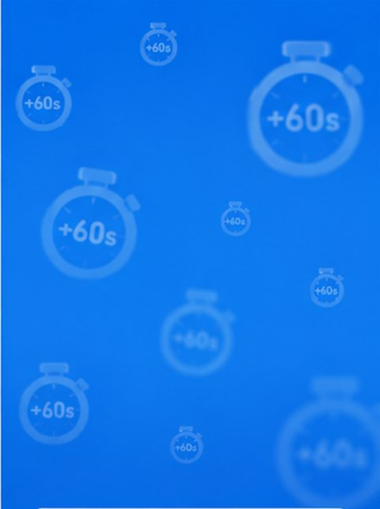 | `fundo-tempo.jpg` | +60s no relógio |
| 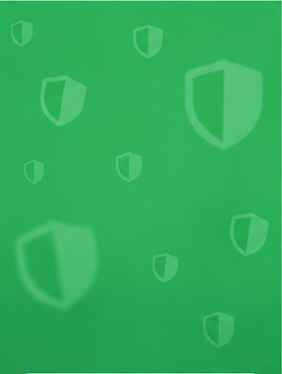 | `fundo-escudo.jpg` | Escudo |
| 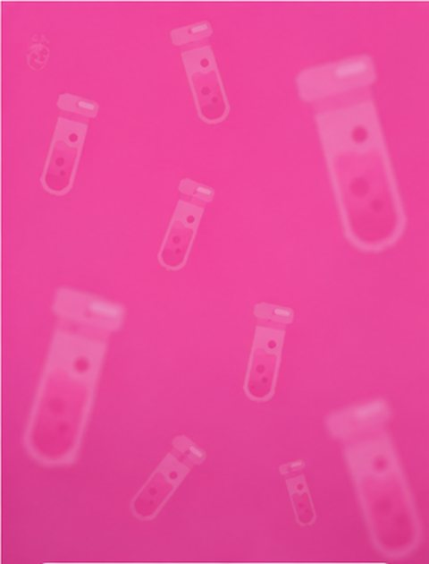 | `fundo-pocao-1.jpg` | Poção ×1,5 |
| 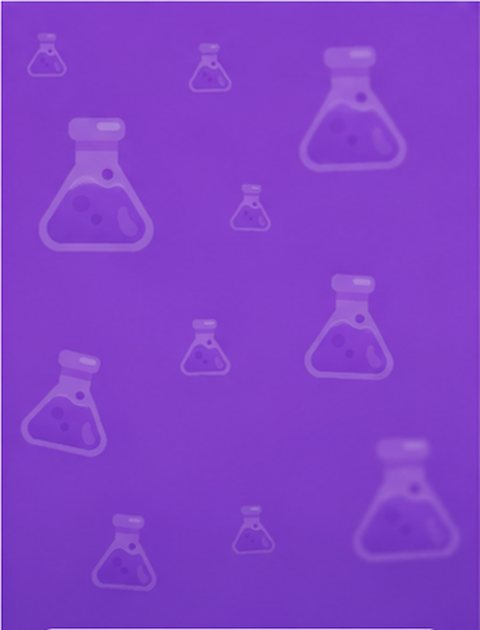 | `fundo-pocao-2.jpg` | Poção ×2 |
| 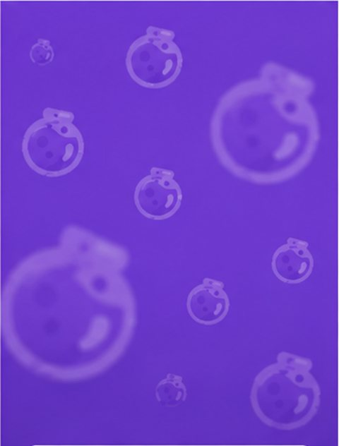 | `fundo-pocao-3.jpg` | Poção ×3 |

---

## 9. Ainda SEM arte (usa lucide/emoji)

| O que | Onde | Situação |
|---|---|---|
| **Fundo do Seguro de Ofensiva** | Resumo pós-partida, página 6 | ⏳ único recurso sem fundo — nome do arquivo: `fundo-seguro-de-ofensiva.png` |
| Ícones das 26 conquistas | Aba Conquistas | Emoji — sem plano de troca ainda |
| Badges das 28 faixas de tabuada | Faixa / progressão | Emoji (🌱 etc.) — sem plano de troca ainda |

Entregue na sessão 083: ícone de erro, troféu, 4 baús fechados de verdade,
combo Poção ×3 sem brilho, baú vazio com moscas e 12 fundos de recompensa.

---

## 10. Pasta de referências — `referencias/icones/`

Os **arquivos originais** que você baixa ficam aqui, organizados por
categoria, em vez de soltos no Downloads (organizado na sessão 081):

| Pasta | O que tem |
|---|---|
| `abas-e-recursos/` | Arena, Liga, Loja, Mochila, Moedas, XP, Vidas |
| `baus/` | Folhas dos 4 baús (abertos e com moedinhas) |
| `combo-recurso-bau/` | Folhas dos ícones combo recurso+baú |
| `ligas-e-podio/` | Escudos das divisões, pódio, divisão bloqueada |
| `missoes/` | Ícones de missão (diária, mensal, tipos, travada, acertos) |
| `ofensiva/` | Chama acesa, congelada, marcadores de calendário |
| `pocoes/` | Folha das poções de XP |
| `power-ups/` | Folhas e ícones individuais dos power-ups |
| `resumo-pos-partida/` | **Mockups de referência** de cada página do resumo |

O que estava no Downloads e **não** era do jogo (documentos, fotos,
instaladores, imagens de escola) não foi tocado.

